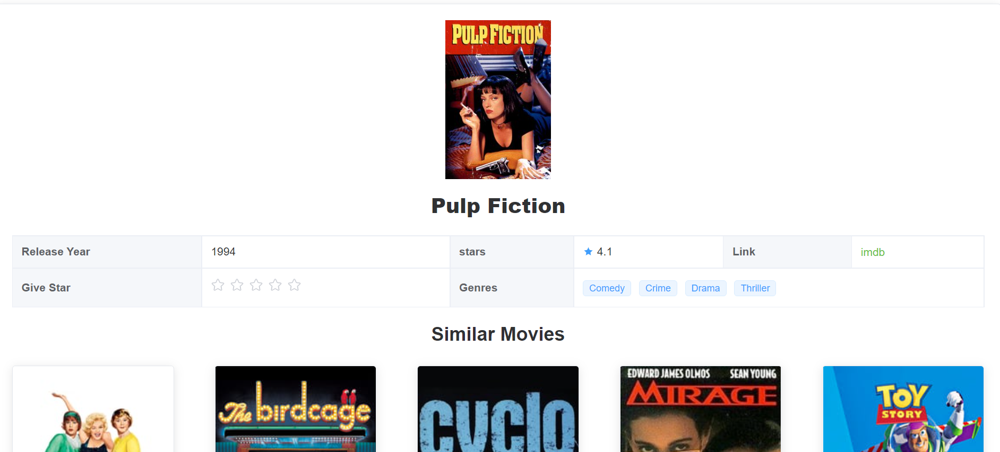
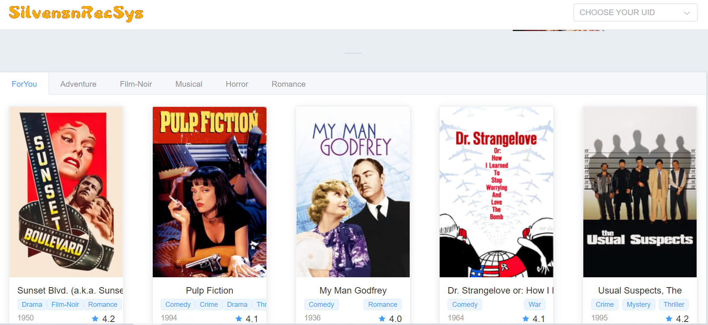
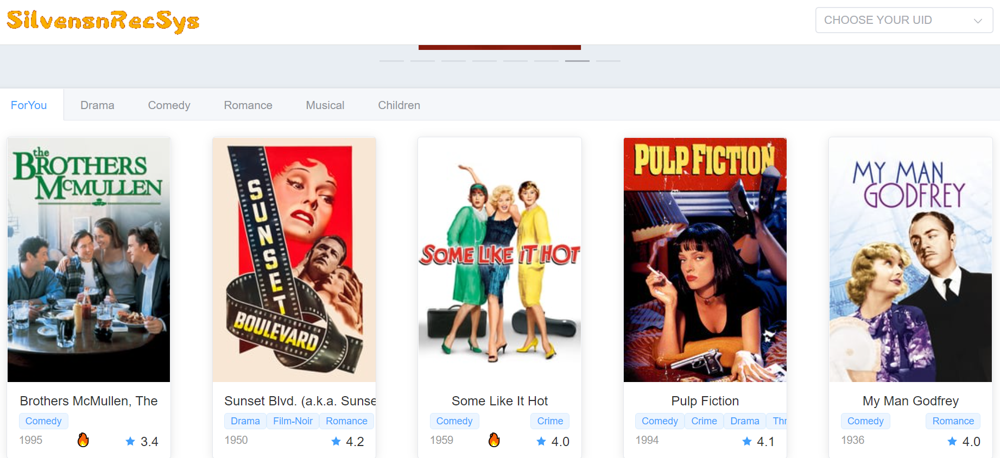
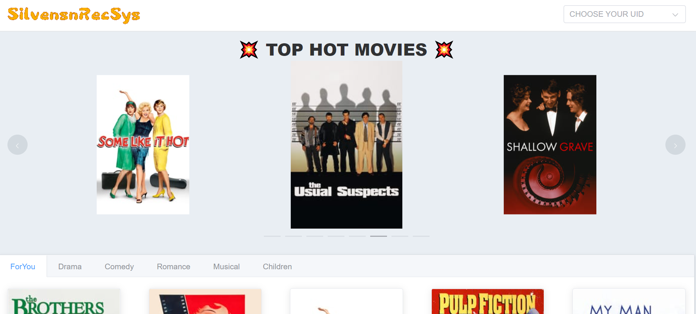
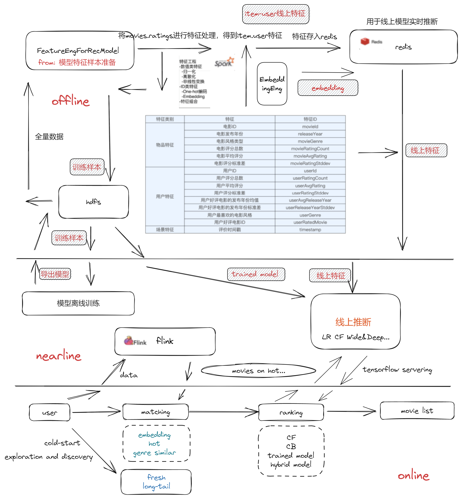

    

> Simple Recommender System

## What's Important

Maybe in several months, I'll come back to update the repository.(now: 📖🏃🏻‍♂️💖)

#### what you can do:

- [ ] rs models
- [ ] docker files
- [ ] other fns
- [ ] directly flink to redis (now it seems a trick) [import specific jar]

Contact me: Silvensn@163.com

> **!!!** the system now is **really really really** rudimentary

## Functions

- similar movies

  

- movies (genres)

  

- recommend for specific user

  

- movies on hot (click shot)

  

  

  

## Envirenment

> `front`
>
> ~ recfront
>
> npm install
>
> npm run dev
>
> `back`
>
> ~ root
>
> make sure: zookeeper kafka(topic: rec3) redis
>
> python3 flinkForRec.py
>
> python3 app.py

- pyspark `3.0.3`
- pyfink `1.14.4`
- kafka `2.4.0` (scala `2.11`) - redis `5.0.9`
- node `v14.17.5` npm `6.14.14` ( `vue3` `element-plus` )

## Architecture

 

